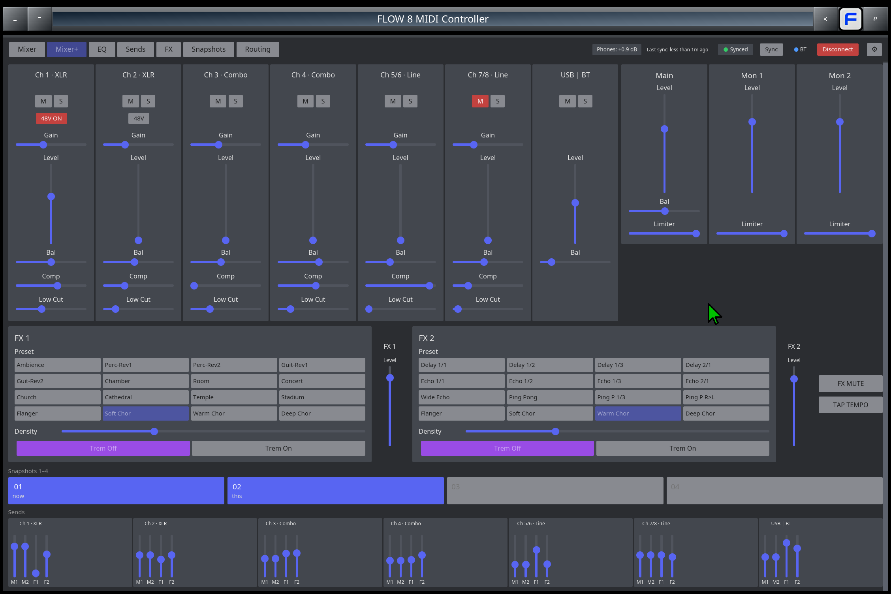
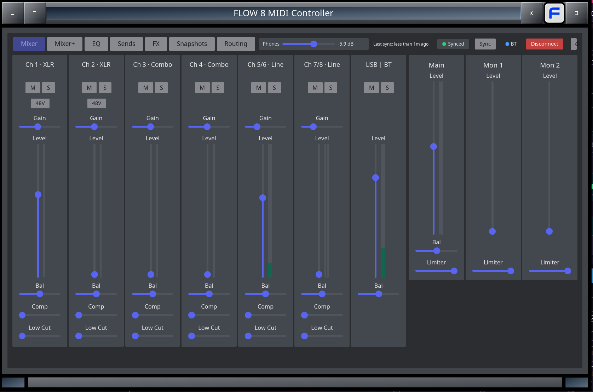
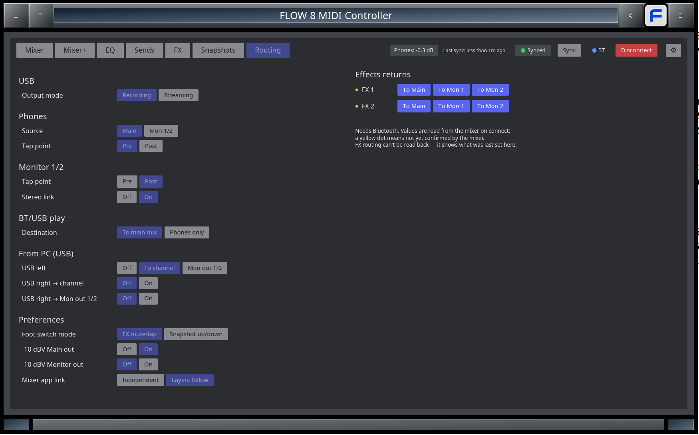
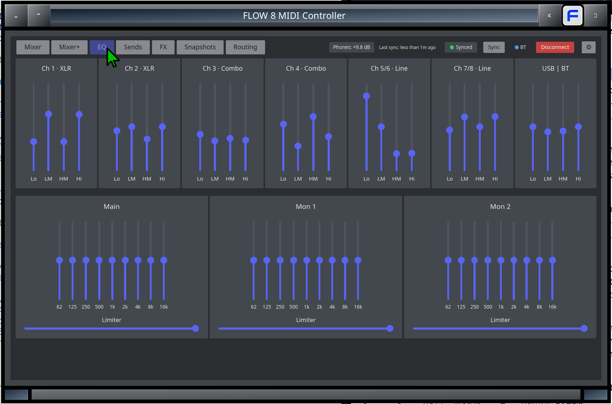
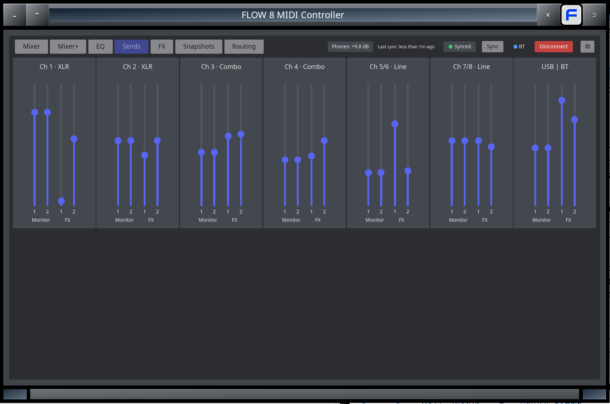
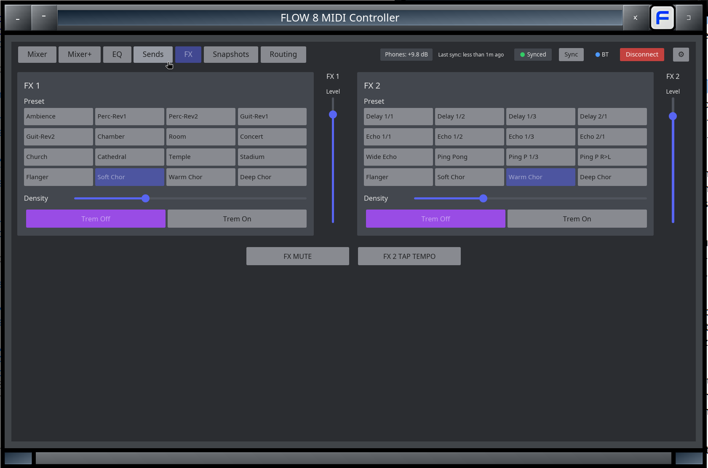
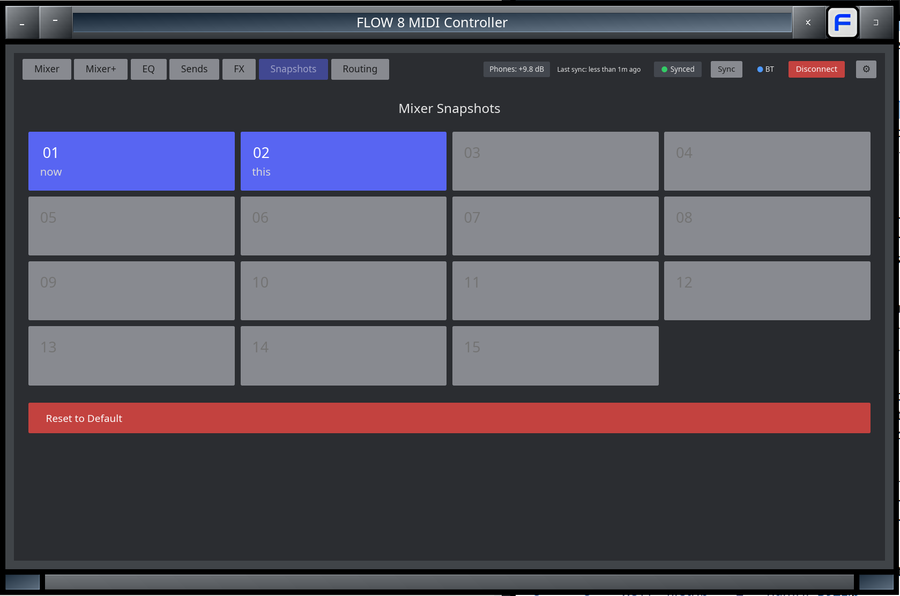

<div align="center">

<br>

# FLOW 8 MIDI Controller

Unofficial desktop controller for the [Behringer FLOW 8](https://www.behringer.com/behringer/product?modelCode=0603-AEW) mixer — Linux, Windows and macOS.



</div>

## Download

Get the latest build from the [Releases page](https://github.com/cou645/flow-8-midi/releases).

Connect the FLOW 8 by USB and start the app. Bluetooth is used automatically to read the mixer's state and for the Routing tab.

## Features

* Mixer, EQ, Sends, FX and Snapshots pages — every control in the FLOW 8 MIDI implementation.
* **Routing tab** (new in 2.0): USB recording/streaming, phones source and pre/post, monitor pre/post and stereo link, BT/USB play, USB return routing, FX return routing, foot switch mode and output pads — previously only in the phone app.
* **PHONES level slider** in the top bar — set the headphone level from the PC (new in 2.1).
* **Live meters** on every input strip and on Main (new in 2.1).
* Sync from the mixer over Bluetooth; settings changed in the mixer's menu show up instantly.

## Screenshots

| | |
|---|---|
| **Mixer** — levels, mute/solo, gain, comp, low cut, 48V, live meters, PHONES slider | **Routing** *(new in 2.0)* — USB, phones, monitor, BT/USB, FX returns, preferences |
|  |  |
| **EQ** — 4-band per channel, 9-band + limiter per bus | **Sends** — Monitor 1/2 and FX 1/2 per channel |
|  |  |
| **FX** — presets, parameters, FX mute, tap tempo | **Snapshots** — load any of the 15 snapshots |
|  |  |

## Building

Requires [Rust](https://www.rust-lang.org/tools/install) 1.85+. On Debian/Ubuntu: `sudo apt install libasound2-dev pkg-config libxkbcommon-dev libwayland-dev libdbus-1-dev`, then:

```bash
cargo run --release
```

More in the [User Manual](./docs/MANUAL.md), [Developer Manual](./docs/DEV_MANUAL.md) and [protocol notes](./docs/flow8-midi-implementation.md).

**[How 2.0 was built](./docs/HOW-WE-BUILT-IT.md)**: a fake FLOW 8 on Linux (BLE pass-through), Android Bluetooth capture, and dump diffing.

## Credits

* Original project: [abelroes/flow-8-midi](https://github.com/abelroes/flow-8-midi) by Abel Rocha Espinosa.
* Version 2.0: directed and hardware-tested by stemsee.
* **AI disclosure**: the 2.x code, protocol research, tools, documentation and README text were written with Claude Opus 5.5 (Anthropic) via Claude Code. No images or video are AI-generated.

If you find this useful, consider [buying me a beer](https://www.buymeacoffee.com/stemsee).

<a href="https://www.buymeacoffee.com/stemsee" target="_blank"></a>

## Disclaimers

* This application is not official. Any damage (to the unit or any peripherals), misuse or act that avoids warranty is not our responsibility. Use it at your own risk.
* When connected via Bluetooth, the app reads the mixer's full state every second by default (adjustable in Settings), so fader and knob moves on the hardware show up within about a second. (The mixer can also push instant notifications for hardware moves; the app doesn't use them for faders yet.)
* On Windows, fetching snapshot names via BLE may fail due to a platform-level BLE subscribe limitation (`"The attribute cannot be written."`). Snapshots still load correctly — only the names are unavailable, so all slots will appear unnamed.
* Current and future implementations are limited by the FLOW 8 MIDI Implementation (Behringer's FLOW 8 Quick Start Guide).
* Later, I found [another solution](https://hexler.net/touchosc) for custom control of this unit. Give it a try and use what is best for you!

## License

[GNU GENERAL PUBLIC LICENSE - Version 3](./LICENSE)
